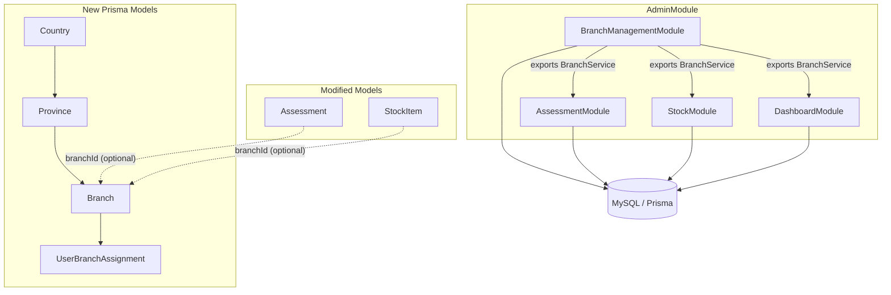

# Design Document — Branch Management

## Overview

Branch Management introduces a three-level geographic hierarchy (Country → Province → Branch) into the trade-in platform. It adds a new `branch-management` sub-module within the existing `AdminModule`, following the same patterns as `catalog`, `stock`, and `dashboard`.

The feature touches three areas:
1. **New CRUD entities**: Country, Province, Branch, and UserBranchAssignment — managed via new controllers/services
2. **Existing entity modifications**: `Assessment` and `StockItem` gain an optional `branchId` foreign key
3. **Existing service modifications**: Assessment creation requires branch selection; stock list, assessment list, and dashboard accept a `branchId` filter

All endpoints live under `/api/v1/admin/branch-management/*` for hierarchy CRUD and user assignment. Existing endpoints (`/api/v1/admin/assessments`, `/api/v1/admin/stock`, `/api/v1/admin/dashboard`) gain an optional `branchId` query parameter.

Frontend adds an `/admin/branches` section for hierarchy management and a branch selector component reused across assessment creation, stock list, and dashboard pages.

## Architecture



The `BranchManagementModule` is a new NestJS module registered in `AdminModule.imports`. It exports `BranchService` so that `AssessmentModule`, `StockModule`, and `DashboardModule` can validate branch IDs and resolve user branch assignments.

### Key Design Decisions

1. **branchId is nullable on Assessment/StockItem** — existing records created before branch management was enabled will have `branchId = null`. This avoids a breaking migration.
2. **No cascading soft-delete** — deleting a Country requires all its Provinces to be deleted first; deleting a Province requires all its Branches to be deleted first. This prevents orphaned data.
3. **UserBranchAssignment is a hard-delete join table** — no soft-delete needed; removing an assignment is a simple DELETE.
4. **Branch filter is additive** — when `branchId` is not provided in queries, all data is returned (backward compatible).

## Components and Interfaces

### Backend Components

#### BranchManagementModule
- **CountryController** — `v1/admin/branch-management/countries`
- **ProvinceController** — `v1/admin/branch-management/provinces`
- **BranchController** — `v1/admin/branch-management/branches`
- **UserBranchController** — `v1/admin/branch-management/user-assignments`
- **HierarchyController** — `v1/admin/branch-management/hierarchy`
- **CountryService** — Country CRUD with duplicate name check and child-guard on delete
- **ProvinceService** — Province CRUD scoped to country, duplicate name within country, child-guard
- **BranchService** — Branch CRUD scoped to province, duplicate name within province, assignment-guard on delete
- **UserBranchService** — Assignment CRUD, user branch resolution
- **HierarchyService** — Nested hierarchy query

#### Modified Services
- **AssessmentService.create()** — accepts `branchId`, validates user is assigned to that branch
- **StockService.addToStock()** — copies `branchId` from assessment to stock item
- **StockService.findAll()** — accepts optional `branchId` filter
- **DashboardService.getMetrics()** — accepts optional `branchId` filter

### API Endpoints

#### Country CRUD
| Method | Path | Role | Description |
|--------|------|------|-------------|
| POST | `/v1/admin/branch-management/countries` | admin-manager | Create country |
| GET | `/v1/admin/branch-management/countries` | admin-manager, admin-operation | List active countries |
| GET | `/v1/admin/branch-management/countries/:id` | admin-manager, admin-operation | Get country with province count |
| PATCH | `/v1/admin/branch-management/countries/:id` | admin-manager | Update country |
| DELETE | `/v1/admin/branch-management/countries/:id` | admin-manager | Soft-delete country |

#### Province CRUD
| Method | Path | Role | Description |
|--------|------|------|-------------|
| POST | `/v1/admin/branch-management/provinces` | admin-manager | Create province |
| GET | `/v1/admin/branch-management/provinces?countryId=` | admin-manager, admin-operation | List provinces (filtered by country) |
| GET | `/v1/admin/branch-management/provinces/:id` | admin-manager, admin-operation | Get province with branch count |
| PATCH | `/v1/admin/branch-management/provinces/:id` | admin-manager | Update province |
| DELETE | `/v1/admin/branch-management/provinces/:id` | admin-manager | Soft-delete province |

#### Branch CRUD
| Method | Path | Role | Description |
|--------|------|------|-------------|
| POST | `/v1/admin/branch-management/branches` | admin-manager | Create branch |
| GET | `/v1/admin/branch-management/branches?provinceId=&countryId=` | admin-manager, admin-operation | List branches (filtered) |
| GET | `/v1/admin/branch-management/branches/:id` | admin-manager, admin-operation | Get branch with user count |
| PATCH | `/v1/admin/branch-management/branches/:id` | admin-manager | Update branch |
| DELETE | `/v1/admin/branch-management/branches/:id` | admin-manager | Soft-delete branch |

#### User-Branch Assignment
| Method | Path | Role | Description |
|--------|------|------|-------------|
| POST | `/v1/admin/branch-management/user-assignments` | admin-manager | Assign user to branch |
| DELETE | `/v1/admin/branch-management/user-assignments/:id` | admin-manager | Remove assignment |
| GET | `/v1/admin/branch-management/user-assignments?branchId=` | admin-manager | List users for a branch |
| GET | `/v1/admin/branch-management/user-assignments?userId=` | admin-manager, admin-operation | List branches for a user |

#### Hierarchy
| Method | Path | Role | Description |
|--------|------|------|-------------|
| GET | `/v1/admin/branch-management/hierarchy` | admin-manager, admin-operation | Full nested hierarchy |
| GET | `/v1/admin/branch-management/hierarchy/:countryId` | admin-manager, admin-operation | Hierarchy for one country |

#### Modified Existing Endpoints
| Endpoint | Change |
|----------|--------|
| `POST /v1/admin/assessments` | Add optional `branchId` to body |
| `GET /v1/admin/stock?branchId=` | Add optional `branchId` query param |
| `GET /v1/admin/dashboard?branchId=` | Add optional `branchId` query param |

### Frontend Components

#### New Pages
- `/admin/branches` — Main branch management page with tabs for Countries, Provinces, Branches
- `/admin/branches/countries/[id]` — Country detail with provinces list
- `/admin/branches/provinces/[id]` — Province detail with branches list
- `/admin/branches/branches/[id]` — Branch detail with assigned users
- `/admin/branches/assignments` — User-branch assignment management

#### Shared Components
- `BranchSelector` — Dropdown that loads user's assigned branches; used in assessment creation form
- `BranchFilter` — Dropdown for filtering by branch; used on stock list, assessment list, and dashboard


## Data Models

### New Prisma Models

```prisma
model Country {
  id        String    @id @default(uuid())
  name      String    @unique
  createdAt DateTime  @default(now())
  updatedAt DateTime  @updatedAt
  deletedAt DateTime?

  provinces Province[]

  @@index([name])
  @@map("admin_countries")
}

model Province {
  id        String    @id @default(uuid())
  name      String
  countryId String
  createdAt DateTime  @default(now())
  updatedAt DateTime  @updatedAt
  deletedAt DateTime?

  country  Country  @relation(fields: [countryId], references: [id])
  branches Branch[]

  @@unique([countryId, name])
  @@index([countryId])
  @@map("admin_provinces")
}

model Branch {
  id         String    @id @default(uuid())
  name       String
  address    String
  provinceId String
  createdAt  DateTime  @default(now())
  updatedAt  DateTime  @updatedAt
  deletedAt  DateTime?

  province    Province              @relation(fields: [provinceId], references: [id])
  assignments UserBranchAssignment[]
  assessments Assessment[]
  stockItems  StockItem[]

  @@unique([provinceId, name])
  @@index([provinceId])
  @@map("admin_branches")
}

model UserBranchAssignment {
  id        String   @id @default(uuid())
  userId    String
  branchId  String
  createdAt DateTime @default(now())

  user   User   @relation(fields: [userId], references: [id])
  branch Branch @relation(fields: [branchId], references: [id])

  @@unique([userId, branchId])
  @@index([userId])
  @@index([branchId])
  @@map("admin_user_branch_assignments")
}
```

### Modified Existing Models

```prisma
// Assessment — add optional branchId
model Assessment {
  // ... existing fields ...
  branchId String?
  branch   Branch? @relation(fields: [branchId], references: [id])

  @@index([branchId])
}

// StockItem — add optional branchId
model StockItem {
  // ... existing fields ...
  branchId String?
  branch   Branch? @relation(fields: [branchId], references: [id])

  @@index([branchId])
}

// User — add assignments relation
model User {
  // ... existing fields ...
  branchAssignments UserBranchAssignment[]
}
```

### Key DTOs

```typescript
// Country
class CreateCountryDto { name: string }
class UpdateCountryDto { name: string }

// Province
class CreateProvinceDto { name: string; countryId: string }
class UpdateProvinceDto { name: string }

// Branch
class CreateBranchDto { name: string; address: string; provinceId: string }
class UpdateBranchDto { name?: string; address?: string }

// User-Branch Assignment
class CreateUserBranchAssignmentDto { userId: string; branchId: string }

// Modified Assessment creation
class CreateAssessmentDto {
  customerId: string;
  productModelId: string;
  branchId?: string; // optional — auto-selected if user has exactly one branch
}
```

### Hierarchy Response Shape

```typescript
interface HierarchyCountry {
  id: string;
  name: string;
  provinces: HierarchyProvince[];
}

interface HierarchyProvince {
  id: string;
  name: string;
  branches: HierarchyBranch[];
}

interface HierarchyBranch {
  id: string;
  name: string;
  address: string;
}
```

### Duplicate Name Uniqueness Rules

| Entity | Scope | Constraint |
|--------|-------|------------|
| Country | Global (among active) | No two active countries with same name |
| Province | Within same country (among active) | No two active provinces with same name in same country |
| Branch | Within same province (among active) | No two active branches with same name in same province |

Note: The `@@unique` constraints in Prisma enforce uniqueness at the DB level. Since soft-deleted records keep their names, the uniqueness check must be done at the service level by filtering `deletedAt IS NULL` before insert/update, rather than relying solely on the DB unique constraint. The `@@unique` on `[countryId, name]` and `[provinceId, name]` serves as a safety net but the primary check is in application code.


## Correctness Properties

*A property is a characteristic or behavior that should hold true across all valid executions of a system — essentially, a formal statement about what the system should do. Properties serve as the bridge between human-readable specifications and machine-verifiable correctness guarantees.*

### Property 1: CRUD creation returns correct entity

*For any* valid entity data (country name, province name + countryId, branch name + address + provinceId, or user-branch assignment), creating it via the corresponding service should return an object with a generated UUID `id` and all input fields matching the provided data.

**Validates: Requirements 1.1, 2.1, 3.1, 4.1**

### Property 2: CRUD update persists changes

*For any* existing Country, Province, or Branch and any valid new field values, updating the entity should return the entity with the new values, and a subsequent findById should reflect those changes.

**Validates: Requirements 1.4, 2.4, 3.4**

### Property 3: Soft-delete sets deletedAt and excludes from listings

*For any* Country, Province, or Branch with no active children, soft-deleting it should set `deletedAt` to a non-null timestamp, and the entity should no longer appear in list queries.

**Validates: Requirements 1.5, 2.5, 3.5, 1.2, 2.2, 3.2**

### Property 4: Listing returns only active records sorted alphabetically

*For any* collection of entities (countries, provinces within a country, branches within a province) where some are soft-deleted, the list endpoint should return only entities with `deletedAt = null`, and the returned array should be sorted alphabetically by `name`.

**Validates: Requirements 1.2, 2.2, 3.2**

### Property 5: FindById returns correct child counts and parent references

*For any* Country with N active provinces, Province with M active branches, or Branch with K assigned users, calling findById should return the entity with the correct child count (N, M, or K respectively) and correct parent name references.

**Validates: Requirements 1.3, 2.3, 3.3**

### Property 6: Duplicate names within scope are rejected

*For any* entity name that already exists among active records within the same scope (global for countries, within-country for provinces, within-province for branches), attempting to create or update another entity with the same name should be rejected with a conflict error.

**Validates: Requirements 1.7, 2.7, 3.7**

### Property 7: Assign then list includes the user-branch pair

*For any* valid user and set of N distinct branches, assigning the user to all N branches should succeed, and listing branches for that user should return exactly those N branches (each with province and country info), and listing users for any of those branches should include that user.

**Validates: Requirements 4.1, 4.3, 4.4, 4.5**

### Property 8: Assign then remove round-trip

*For any* user-branch assignment, creating the assignment and then removing it should result in the user no longer appearing in the branch's user list and the branch no longer appearing in the user's branch list.

**Validates: Requirements 4.1, 4.2**

### Property 9: Duplicate assignment is rejected

*For any* existing user-branch assignment, attempting to create the same assignment again should be rejected with a conflict error, and the total number of assignments should remain unchanged.

**Validates: Requirements 4.7**

### Property 10: Assessment creation records branchId from user's assignments

*For any* admin-operation user with branch assignments, creating an assessment with a branchId from their assigned branches should succeed and the resulting assessment should have that branchId. If the user has exactly one branch and no branchId is provided, the assessment should auto-select that branch.

**Validates: Requirements 5.1, 5.7**

### Property 11: StockItem inherits branchId from Assessment

*For any* assessment with a non-null branchId, when it is added to stock, the resulting StockItem should have the same branchId as the assessment.

**Validates: Requirements 5.2**

### Property 12: Branch filter returns only matching records

*For any* set of assessments and stock items distributed across multiple branches, filtering by a specific branchId should return only records where `branchId` matches the filter. This applies to assessment lists, stock lists, and dashboard metric computations.

**Validates: Requirements 5.3, 5.4, 5.5**

### Property 13: Role-based access control enforcement

*For any* user role and branch-management operation, write operations (create, update, delete on Country/Province/Branch and create/delete on assignments) should succeed only for `admin-manager` role, and read operations should succeed for both `admin-manager` and `admin-operation` roles. Any other role should receive a 403 Forbidden response.

**Validates: Requirements 6.1, 6.2, 6.3, 6.4**

### Property 14: Hierarchy returns only active records, nested and sorted

*For any* set of countries, provinces, and branches where some are soft-deleted, the hierarchy endpoint should return a nested structure containing only active records. Within each level, entities should be sorted alphabetically by name. For a single-country hierarchy request, only that country's subtree should be returned.

**Validates: Requirements 7.1, 7.2, 7.3**


## Error Handling

Following the existing RFC 7807 error format and `[DOMAIN]_[NUMBER]` code convention:

| Code | Status | Condition |
|------|--------|-----------|
| BRANCH_001 | 409 | Duplicate country name among active records |
| BRANCH_002 | 409 | Duplicate province name within same country among active records |
| BRANCH_003 | 409 | Duplicate branch name within same province among active records |
| BRANCH_004 | 409 | Duplicate user-branch assignment |
| BRANCH_005 | 400 | Cannot delete country with active provinces |
| BRANCH_006 | 400 | Cannot delete province with active branches |
| BRANCH_007 | 400 | Cannot delete branch with active user assignments |
| BRANCH_008 | 400 | User has no branch assignments — cannot create assessment |
| BRANCH_009 | 400 | Provided branchId is not in user's assigned branches |
| NOT_FOUND_001 | 404 | Country, Province, Branch, User, or Assignment not found |
| AUTH_002 | 403 | Insufficient role for the requested operation |

All errors use the existing `ValidationException`, `NotFoundException`, and `ConflictException` from `shared/errors`, which already format responses as RFC 7807.

## Testing Strategy

### Unit Tests (Vitest)

Unit tests cover specific examples and edge cases:
- Service methods with mocked PrismaService
- Edge cases: deleting entity with children, creating with deleted parent, duplicate names
- Auto-select branch when user has exactly one assignment
- Assessment creation with no branch assignments (error case)
- StockItem branchId propagation from assessment

### Property-Based Tests (Vitest + fast-check)

Each correctness property maps to a single property-based test with minimum 100 iterations.

Test files follow the existing convention: `*.pbt.spec.ts`

| Test File | Properties Covered |
|-----------|-------------------|
| `country.service.pbt.spec.ts` | Properties 1, 2, 3, 4, 5, 6 (country subset) |
| `province.service.pbt.spec.ts` | Properties 1, 2, 3, 4, 5, 6 (province subset) |
| `branch.service.pbt.spec.ts` | Properties 1, 2, 3, 4, 5, 6 (branch subset) |
| `user-branch.service.pbt.spec.ts` | Properties 7, 8, 9 |
| `branch-scoped-data.pbt.spec.ts` | Properties 10, 11, 12 |
| `hierarchy.service.pbt.spec.ts` | Property 14 |

Property 13 (RBAC) is tested via unit tests since it relies on NestJS guard decorators rather than service logic.

Each property test must be tagged with a comment:
```typescript
// Feature: branch-management, Property 1: CRUD creation returns correct entity
```

### Integration Tests

- Full CRUD flow for each entity type via HTTP requests
- Hierarchy endpoint returns correct nested structure
- Assessment creation with branch selection end-to-end
- Dashboard metrics with branch filter

